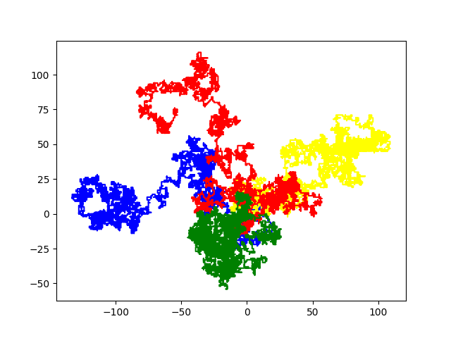

# In this scrip can simulate a random walker with one or more "random walkers", to graphic is used matplotlib.

## Example of use

Suppose you want simulate two random walkers for 1000 steps. You should run the next in your command line.

`python main.py --walker 2 --steps 1000`

## How use a virtual environment

first you should install virtualenv with: 

`apt-get install virtualenv`

then, to create a virtualenv with python 3.7 you should run this in your command line.

`virtualenv env --pytohn=python3.7`